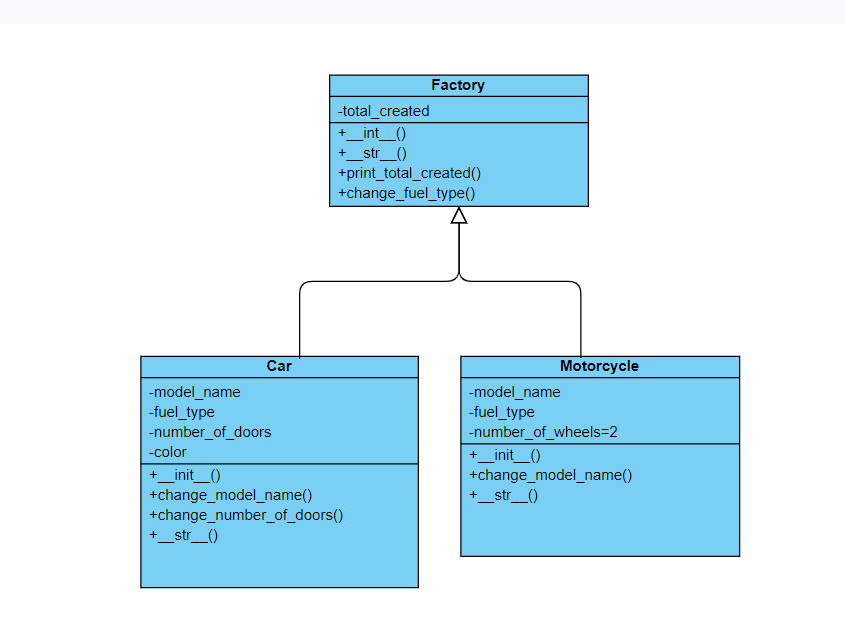

## Vehicle Factory with Car and Motorcycle Implementations

This project implements a basic vehicle factory using an abstract base class (`Factory`) and concrete subclasses (`Car` and `Motorcycle`). It demonstrates object-oriented programming principles and data validation.

**Key Features:**

* **Factory Abstraction:** The abstract `Factory` class provides a blueprint for creating vehicles, including tracking total vehicles created.
* **Concrete Vehicle Implementations:** `Car` and `Motorcycle` classes inherit from `Factory`, defining specific attributes and methods for each vehicle type.
* **Data Validation:** Methods for changing vehicle properties (`change_fuel_type`, `change_number_of_doors`) perform basic validation to ensure valid values are assigned.
* **Inheritance and Method Overriding:** `Car` and `Motorcycle` override the abstract `__str__` method to provide tailored string representations.

**Class Structure:**

**Factory (Abstract Base Class):**

* `_total_created` (class variable): Tracks the total number of vehicles created.
* `__init__` (abstract method): Enforces implementation in subclasses for vehicle creation.
* `print_total_created` (class method): Prints the total number of vehicles created for a specific class.
* `__str__` (abstract method): Requires subclasses to define string representation.

**Car:**

* Inherits from `Factory`.
* `_model_name`, `_fuel_type`, `_color`, `_number_of_doors`: Stores car-specific attributes.
* `__init__`: Initializes car attributes with validation for fuel type and number of doors.
* `change_model_name`, `change_fuel_type`, `change_color`, `change_number_of_doors`: Methods for modifying car properties with validation.
* `__str__`: Returns a string representation of a car.

**Motorcycle:**

* Inherits from `Factory`.
* `_model_name`, `_fuel_type`, `_number_of_wheels`: Stores motorcycle-specific attributes.
* `__init__`: Initializes motorcycle attributes with validation for fuel type.
* `change_model_name`, `change_fuel_type`: Methods for modifying motorcycle properties with validation.
* `__str__`: Returns a string representation of a motorcycle.

**Potential Enhancements:**

* **Error Handling:** Consider implementing more robust error handling for invalid user input.
* **Unit Tests:** Write unit tests to verify the functionality of different components.
* **Additional Vehicle Types:** This can be extended to support other vehicle types.
* **Documentation Strings (Docstrings):** Add comments to document classes, methods, and functions.

**class Digram:**

